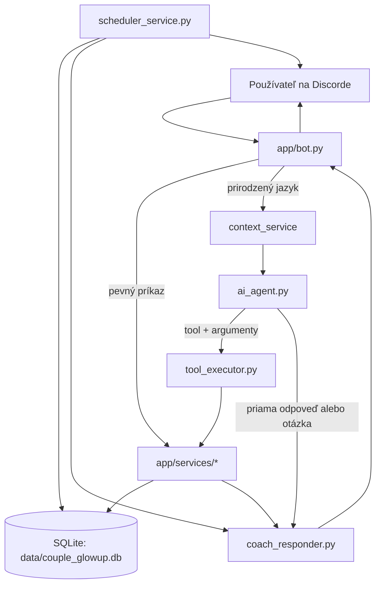
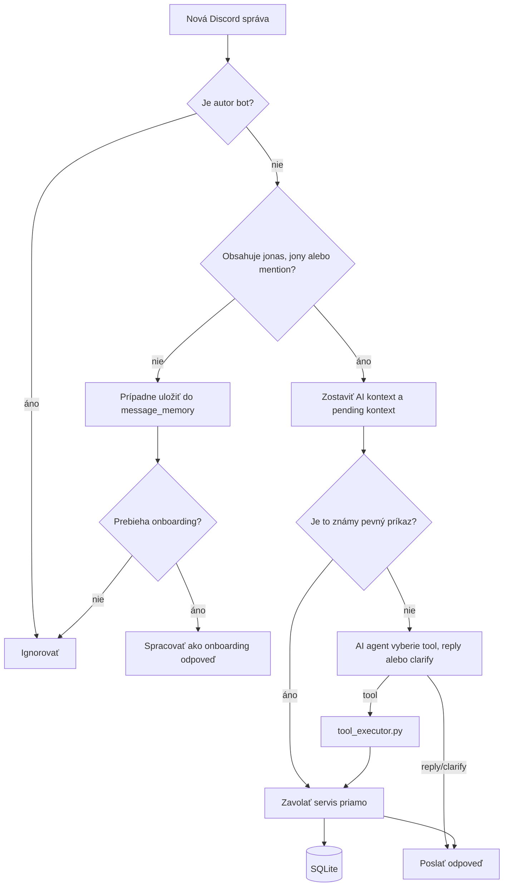
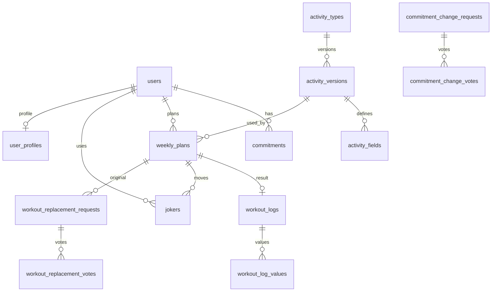
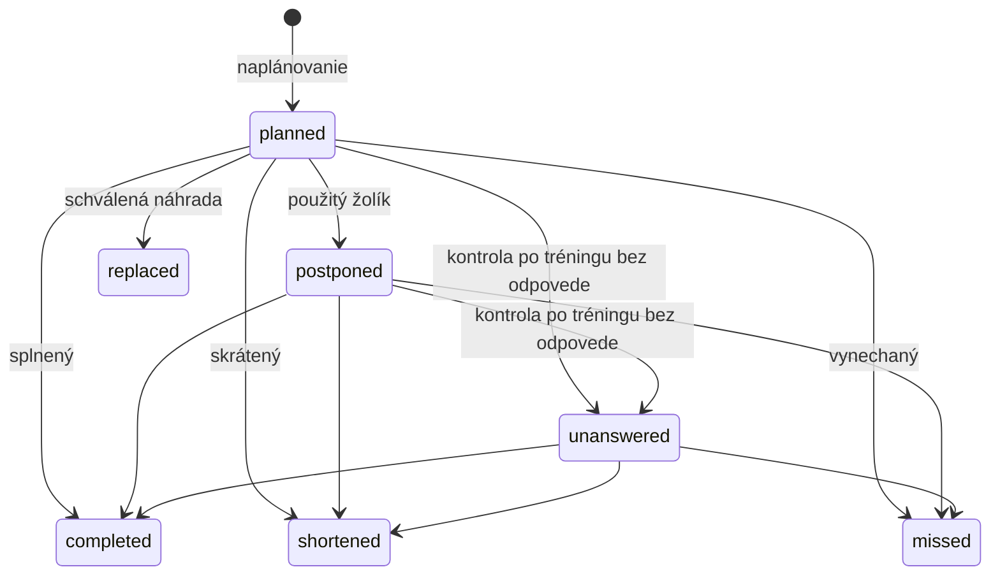

# Ako funguje Couple GlowUp Bot

Tento dokument vysvetľuje aktuálny stav projektu podľa zdrojového kódu. Projektová
definícia a pôvodná predstava sú v `Couple_GlowUp_Coach_definicia_v0_2.pdf`; tento
dokument opisuje, **ako je bot reálne naprogramovaný teraz**.

## 1. Čo tento projekt robí

Couple GlowUp Bot je Discord fitness tréner s menom Jonáš. Pomáha malej skupine:

- zaregistrovať používateľov a nastaviť im týždenné tréningové záväzky,
- rozložiť záväzky na konkrétne dni a časy,
- zapísať splnené, skrátené alebo vynechané tréningy,
- raz týždenne posunúť tréning pomocou žolíka,
- riešiť zmeny záväzkov a náhrady tréningov spoločným hlasovaním,
- posielať automatické pripomienky,
- počítať mesačné štatistiky,
- rozumieť pevným príkazom aj prirodzenému slovenskému jazyku.

Najdôležitejší princíp projektu je:

> AI môže pochopiť správu a navrhnúť akciu, ale pravidlá a zápis do databázy vždy
> vykonáva Python.

To znamená, že OpenAI model nemôže svojvoľne označiť tréning ako splnený, minúť
žolíka alebo prepísať cudzí tréning. Každú takúto akciu ešte overí príslušná
servisná funkcia.

## 2. Rýchly mentálny model

Projekt sa dá pochopiť ako päť vrstiev:

1. **Discord vrstva** prijme správu a pošle odpoveď.
2. **AI vrstva** pochopí voľne napísanú správu a vyberie bezpečný tool.
3. **Tool executor** preloží názov toolu na konkrétnu Python funkciu.
4. **Servisná vrstva** obsahuje pravidlá aplikácie a pracuje s dátami.
5. **SQLite databáza** uchováva používateľov, plány, výsledky a históriu.



## 3. Štruktúra projektu

```text
GlowUp_bot/
├── Couple_GlowUp_Coach_definicia_v0_2.pdf  # pôvodná definícia projektu
├── How_it_works.md                          # tento dokument
├── requirements.txt                         # Python závislosti
├── .env                                     # tajné kľúče a konfigurácia, nie je v Gite
├── .gitignore
├── data/
│   └── couple_glowup.db                     # lokálna SQLite databáza, nie je v Gite
└── app/
    ├── main.py                              # štart aplikácie
    ├── config.py                            # načítanie .env
    ├── database.py                          # databázové pripojenie a tabuľky
    ├── bot.py                               # Discord udalosti, príkazy a hlavné flow
    ├── ai_agent.py                          # hlavné AI rozhodovanie
    ├── ai_router.py                         # staršia/jednoduchšia AI klasifikácia
    ├── ai_parser.py                         # starší parser správ na intenty
    ├── tool_executor.py                     # bezpečné vykonanie AI toolov
    └── services/
        ├── users_service.py
        ├── onboarding_service.py
        ├── commitments_service.py
        ├── commitment_change_service.py
        ├── planning_service.py
        ├── workout_service.py
        ├── joker_service.py
        ├── replacement_service.py
        ├── stats_service.py
        ├── scheduler_service.py
        ├── context_service.py
        ├── pending_actions_service.py
        ├── coach_responder.py
        └── dev_reset_service.py
```

Súbory `app/__init__.py` a `app/services/__init__.py` iba označujú priečinky ako
Python balíky. Momentálne neobsahujú aplikačnú logiku.

## 4. Ako sa aplikácia spustí

Spustenie:

```powershell
python -m app.main
```

Tok pri štarte:

1. `app/main.py` zavolá `init_database()`.
2. `app/database.py` vytvorí chýbajúce SQLite tabuľky.
3. `app/main.py` zavolá `run_bot()`.
4. `app/bot.py` pripojí Discord klienta pomocou `DISCORD_TOKEN`.
5. Discord vyvolá `on_ready()`.
6. `on_ready()` spustí časovač zo `scheduler_service.py`.

Konfiguráciu načítava `app/config.py` zo súboru `.env`:

| Premenná | Význam |
|---|---|
| `DISCORD_TOKEN` | Token Discord bota; bez neho aplikácia odmietne štart |
| `DISCORD_CHANNEL_ID` | Kanál, v ktorom sa ukladajú správy a posielajú pripomienky |
| `BOT_TIMEZONE` | Časové pásmo schedulera, predvolene `Europe/Bratislava` |
| `OPENAI_API_KEY` | Kľúč pre prirodzený jazyk a trénerove AI odpovede |
| `OPENAI_MODEL` | OpenAI model, predvolene `gpt-5.4-mini` |
| `ADMIN_DISCORD_USER_ID` | Používateľ oprávnený na admin/debug akcie |

Ak chýba OpenAI kľúč, pevné príkazy stále fungujú. Nefunguje však AI pochopenie
prirodzeného jazyka ani generovanie variabilných trénerových odpovedí.

## 5. Ako sa spracuje Discord správa

Hlavný vstup je funkcia `on_message()` v `app/bot.py`.



### Aktivácia bota

Bot reaguje, keď správa obsahuje:

- textový alias `jonas`, `jonáš` alebo `jony`,
- alebo skutočný Discord mention bota.

Funkcia `_extract_command_text()` odstráni alias/mention a zvyšok správy ďalej
spracuje ako príkaz alebo prirodzený jazyk.

### Dve cesty spracovania

**Pevné príkazy** sú explicitné formáty ako:

```text
jonas register Matúš
jonas plan beh piatok 18:00
jonas done 1 5.2 32
jonas stats 2026-06
```

`bot.py` ich rozpozná cez obyčajné podmienky a zavolá servis priamo. Sú
predvídateľné a fungujú aj bez OpenAI.

**Prirodzený jazyk** je napríklad:

```text
jonas v piatok večer o šiestej si dám beh
jonas presuň mi sobotný tréning na nedeľu o desiatej
jonas ako mám zlepšiť tempo pri behu?
```

Takáto správa ide do `ai_agent.py`, ktorý vráti štruktúrované rozhodnutie:

- `mode="tool"`: treba vykonať akciu,
- `mode="reply"`: stačí konverzačná alebo tréningová odpoveď,
- `mode="clarify"`: treba si vypýtať chýbajúci údaj.

## 6. AI vrstva a prečo je bezpečná

### `app/ai_agent.py`

Toto je hlavná aktuálna AI rozhodovacia vrstva. OpenAI dostane:

- aktuálnu správu,
- meno autora,
- dnešný dátum,
- kontext používateľa a plánu,
- otvorenú pending akciu.

Model musí odpovedať podľa pevnej JSON schémy. Nemôže vrátiť ľubovoľný názov
funkcie; vyberá iba z povoleného zoznamu `TOOLS`. Výsledok stále nič nezapisuje.
Iba hovorí napríklad:

```json
{
  "mode": "tool",
  "tool": "log_workout_done",
  "args": {
    "plan_ref": 2,
    "result_text": "5.2 km za 32 min"
  }
}
```

### `app/tool_executor.py`

Tool executor je most medzi AI rozhodnutím a servisnou vrstvou:

- skontroluje povinné argumenty,
- preloží používateľské číslo tréningu na interné databázové ID,
- zavolá správny servis,
- vráti úspech, faktický výsledok a typ odpovede,
- zachytí chyby tak, aby zlá AI odpoveď nerozbila bota.

Príklad: AI vyberie `log_workout_done`, ale až `workout_service.py` overí, či
tréning existuje, patrí autorovi a ešte sa dá upraviť.

### `app/ai_router.py` a `app/ai_parser.py`

Tieto moduly predstavujú staršiu alebo pomocnú AI cestu:

- `ai_router.py` klasifikuje správu na route a intent,
- `ai_parser.py` prekladá správu na staršiu schému intentov.

`bot.py` ešte používa router pri debug príkaze `jonas ai test ...` a obsahuje
pomocnú funkciu `_execute_ai_intent()`. Bežná neznáma správa však na konci
`on_message()` ide cez novší `ai_agent.py` a `tool_executor.py`.

### `app/services/coach_responder.py`

Servis dostane hotový faktický výsledok a môže ho preformulovať do prirodzenej
trénerovej odpovede. Nesmie zmeniť fakty ani pravidlá. Pri výpadku OpenAI vráti
pôvodný faktický text.

Systémové chyby a doplňujúce otázky sa posielajú priamo, bez zbytočného AI
prepisovania.

## 7. Servisná vrstva: kde žijú pravidlá

Servisy sú najdôležitejšie miesto pri úpravách správania aplikácie. Každý servis
má jednu hlavnú oblasť zodpovednosti.

### `users_service.py`

- registruje Discord používateľa,
- zabraňuje duplicitnej registrácii,
- vypisuje aktívnych používateľov.

Komunikuje priamo s tabuľkou `users`.

### `onboarding_service.py`

- spustí onboarding,
- z jednej vety vytiahne navrhované záväzky,
- uloží rozpracovaný návrh,
- po potvrdení zavolá `commitments_service.set_commitment()`.

Používa vlastný jednoduchý regex parser a tabuľku `onboarding_sessions`. Počas
aktívneho onboardingu môže `bot.py` spracovať aj správu bez oslovenia „jonas“.

### `commitments_service.py`

Záväzok hovorí, koľkokrát týždenne má používateľ vykonať určitý typ tréningu,
napríklad `beh 2x`.

Servis:

- vytvára alebo aktualizuje záväzok,
- dovolí záväzok iba pre aktívnu aktivitu z dynamického katalógu,
- vypisuje aktívne záväzky.

### `commitment_change_service.py`

Po onboardingu sa existujúci záväzok nemení len tak. Zmena vytvorí request a
automaticky zapíše súhlas žiadateľa. Zmena sa aplikuje až vtedy, keď ju schvália
všetci aktívni používatelia. Jeden nesúhlas request odmietne.

Po jednomyseľnom súhlase tento servis zavolá `commitments_service.set_commitment()`.

### `planning_service.py`

Spravuje týždenný kalendár:

- normalizuje slovenské dni a kontroluje čas,
- pridáva tréning do aktuálneho týždňa,
- nedovolí naplánovať viac tréningov daného typu, než určuje záväzok,
- vypisuje osobný aj skupinový týždeň,
- porovnáva záväzky s naplánovanými tréningmi,
- prekladá používateľské číslo `[1]`, `[2]` na interné databázové ID.

Používateľské číslo tréningu nie je trvalé ID. Vypočíta sa podľa poradia
tréningov v aktuálnom týždni. Preto sa v Discorde používa pohodlné číslo, ale
služby následne pracujú s interným `weekly_plans.id`.

### `workout_service.py`

Zapisuje výsledok naplánovaného tréningu:

- `completed`: splnený,
- `shortened`: skrátený,
- `missed`: vynechaný.

Kontroluje vlastníka a povolený pôvodný stav. Povinné výsledkové parametre načíta
z konkrétnej verzie aktivity. Čísla, trvanie a hodnotenie uloží v numerickej
forme; textové parametre uloží ako text.

### `activity_service.py`

Spravuje prázdny, používateľmi vytváraný katalóg aktivít. Každá aktivita má
verzovanú schému povinných výsledkov typu číslo, trvanie, text alebo hodnotenie.
Pridanie je okamžité; úpravu alebo deaktiváciu musí schváliť admin.

### `joker_service.py`

Každý používateľ má najviac jedného žolíka za týždeň. Žolík:

- posunie vlastný neukončený tréning,
- môže ho posunúť najviac o jeden deň dopredu,
- nemôže posunúť nedeľu do ďalšieho týždňa,
- uloží audit pôvodného aj nového termínu,
- zmení stav tréningu na `postponed`.

Presun na rovnaký alebo skorší deň rieši `tool_executor.py` priamo. Presun na
neskorší deň vytvorí pending potvrdenie, pretože minie žolíka.

### `replacement_service.py`

Objektívna náhrada znamená nahradiť pôvodný tréning inou schválenou aktivitou.
Servis:

- nájde pôvodný tréning podľa čísla alebo popisu,
- dovolí iba aktívnu náhradnú aktivitu z katalógu,
- vytvorí návrh náhrady a hlas žiadateľa,
- čaká na súhlas všetkých aktívnych používateľov,
- po súhlase označí pôvodný plán ako `replaced` a vytvorí nový plán.

Ak aktivita nie je známa, vytvorí pending rozhodnutie pre admina.

### `pending_actions_service.py`

Pending action je rozpracovaná alebo čakajúca akcia. Používa sa napríklad, keď:

- chýba údaj v prirodzenej správe,
- používateľ musí potvrdiť minutie žolíka,
- admin musí rozhodnúť o novom type aktivity.

Pred vytvorením novej pending akcie sa staré otvorené akcie toho istého
používateľa označia ako vyriešené. AI dostáva pending akciu v kontexte, takže
vie pochopiť následnú krátku odpoveď ako „áno“ alebo „v piatok o 18:00“.

### `context_service.py`

Buduje textový kontext pre AI. Obsahuje:

- aktuálneho používateľa,
- dnešný a zajtrajší dátum,
- jeho plán aktuálneho týždňa,
- záväzky,
- stav žolíka,
- otvorené zmeny a náhrady,
- posledné správy v nastavenom Discord kanáli.

Správy v hlavnom kanáli sa ukladajú do `message_memory`. Botove vlastné správy
sa neukladajú, pretože `on_message()` ich hneď ignoruje.

### `stats_service.py` a `training_query_service.py`

Počíta mesačné osobné aj skupinové štatistiky:

- počet splnených, skrátených, vynechaných a nahradených tréningov,
- úspešnosť,
- dynamické číselné výsledky definované aktivitami,
- bezpečné súčty, priemery, minimá, maximá a počty bez ľubovoľného SQL,
- počet použitých žolíkov,
- hodnotenie a odmenu za mesiac bez vynechaného tréningu.

Mesačné zaradenie sa počíta podľa dátumu naplánovaného tréningu, nie podľa času
vytvorenia databázového záznamu.

### `scheduler_service.py`

Po pripojení bota spustí nekonečný async loop, ktorý každú minútu kontroluje čas.

Automatické udalosti:

| Čas | Akcia |
|---|---|
| nedeľa 19:00 | výzva na plánovanie týždňa |
| každý deň 06:00 | ranný prehľad dnešných tréningov |
| každý deň 20:00 | príprava na zajtrajšie tréningy |
| 15 minút pred tréningom | pripomienka začiatku |
| 60 až 119 minút po začiatku | otázka na výsledok a stav `unanswered` |
| 05:59 | pripomenutie včerajších nezodpovedaných tréningov |

Tabuľka `notification_log` zabezpečuje, že rovnaká automatická správa sa nepošle
viackrát ani po opätovnom pripojení bota.

### `dev_reset_service.py`

Obsahuje vývojové mazanie dát jedného používateľa alebo celého projektu. Volanie
z Discordu chráni `ADMIN_DISCORD_USER_ID`. Tento servis fyzicky maže súvisiace
záznamy v správnom poradí.

## 8. Databáza

Projekt používa SQLite databázu `data/couple_glowup.db`. Všetky spojenia vytvára
`app/database.py` cez `get_connection()`.

`init_database()` sa spustí pri každom štarte a vytvorí chýbajúce tabuľky.
Funkcia `_ensure_column()` slúži ako veľmi jednoduchá migrácia pre doplnenie
stĺpcov bez zmazania existujúcich dát.



### Význam tabuliek

| Tabuľka | Čo uchováva |
|---|---|
| `users` | Discord ID, meno a aktivitu používateľov |
| `activity_types` | stabilné identity aktivít a ich aktívny stav |
| `activity_versions` | nemenné verzie názvu a schémy aktivity |
| `activity_fields` | povinné parametre konkrétnej verzie aktivity |
| `activity_change_requests` | adminom schvaľované úpravy a deaktivácie |
| `commitments` | povinný počet tréningov určitého typu za týždeň |
| `weekly_plans` | konkrétne tréningy s dňom, časom a stavom |
| `workout_logs` | výsledok jedného tréningu; maximálne jeden log na plán |
| `workout_log_values` | dynamické hodnoty parametrov výsledku |
| `jokers` | jeden auditovaný posun používateľa za týždeň |
| `notification_log` | kľúče už poslaných automatických správ |
| `message_memory` | posledné ľudské správy pre AI kontext |
| `pending_actions` | rozpracované otázky, potvrdenia a admin rozhodnutia |
| `user_profiles` | pripravený profil cieľa, úrovne a limitov; zatiaľ málo používaný |
| `onboarding_sessions` | rozpracovaný onboarding a návrh záväzkov |
| `commitment_change_requests` | návrhy zmien záväzkov |
| `commitment_change_votes` | hlasy k zmenám záväzkov |
| `workout_replacement_requests` | návrhy náhrad tréningov |
| `workout_replacement_votes` | hlasy k náhradám |

### Životný cyklus tréningu

Najčastejšie stavy v `weekly_plans.status`:



Stavy `completed`, `shortened`, `missed` a `replaced` sú prakticky ukončené.

## 9. Hlavné používateľské scenáre

### Registrácia a onboarding

```text
Discord správa
→ bot.py
→ users_service.register_user()
→ users
→ onboarding_service.start_onboarding()
→ onboarding_sessions
→ onboarding_service.confirm_onboarding()
→ commitments_service.set_commitment()
→ commitments
```

### Naplánovanie tréningu

```text
Správa alebo AI tool plan_workout
→ planning_service.add_plan()
→ kontrola používateľa
→ kontrola existujúceho záväzku
→ kontrola týždenného limitu
→ INSERT do weekly_plans
```

### Zapísanie výsledku

```text
Používateľské číslo tréningu
→ planning_service.resolve_plan_reference()
→ interné weekly_plans.id
→ workout_service.complete_workout()/shorten_workout()/miss_workout()
→ kontrola vlastníka a stavu
→ UPDATE weekly_plans
→ INSERT workout_logs
```

### Presun tréningu

- Rovnaký alebo skorší deň: `tool_executor.py` upraví plán priamo.
- Neskorší deň: vytvorí sa pending potvrdenie.
- Po potvrdení: `joker_service.use_joker()` overí pravidlá, zapíše `jokers` a
  upraví `weekly_plans`.

### Zmena záväzku alebo náhrada tréningu

```text
Žiadosť
→ request tabuľka + automatický hlas žiadateľa
→ hlasy všetkých aktívnych používateľov
→ jednomyseľný súhlas
→ aplikovanie zmeny
```

## 10. Dôležité pravidlá systému

- Aktivitu treba najprv vytvoriť aj s povinnými parametrami výsledku.
- Úpravu alebo deaktiváciu aktivity musí schváliť admin.
- Používateľ môže meniť iba vlastné tréningy.
- Plánovanie rešpektuje počet tréningov v aktívnom záväzku.
- Jeden používateľ má jeden žolík na týždeň.
- Žolík posúva tréning maximálne o jeden deň dopredu.
- Zmena existujúceho záväzku potrebuje jednomyseľný súhlas aktívnych používateľov.
- Objektívna náhrada tréningu tiež potrebuje jednomyseľný súhlas.
- AI iba navrhuje; servisná vrstva rozhoduje, či je akcia platná.

## 11. Ktorý súbor upraviť pri konkrétnej zmene

| Chcem zmeniť... | Začni v súbore |
|---|---|
| reakciu na Discord príkaz alebo pridať pevný príkaz | `app/bot.py` |
| zoznam AI toolov alebo AI rozhodovanie | `app/ai_agent.py` |
| vykonanie AI toolu | `app/tool_executor.py` |
| tón a formuláciu AI odpovedí | `app/services/coach_responder.py` |
| databázovú tabuľku alebo stĺpec | `app/database.py` |
| katalóg aktivít a ich parametre | `app/services/activity_service.py` |
| pravidlá plánovania | `app/services/planning_service.py` |
| zápis výsledkov | `app/services/workout_service.py` |
| pravidlá žolíka | `app/services/joker_service.py` |
| automatické časy a pripomienky | `app/services/scheduler_service.py` |
| štatistiky a odmeny | `app/services/stats_service.py` |
| hlasovanie o záväzkoch | `app/services/commitment_change_service.py` |
| hlasovanie o náhrade | `app/services/replacement_service.py` |
| kontext, ktorý vidí AI | `app/services/context_service.py` |
| rozpracované konverzačné kroky | `app/services/pending_actions_service.py` |

Pri novej AI akcii sú zvyčajne potrebné tri zmeny:

1. pridať tool a pravidlá do `ai_agent.py`,
2. namapovať tool v `tool_executor.py`,
3. implementovať alebo zavolať pravidlo v príslušnom servise.

## 12. Závislosti a externé systémy

Hlavné závislosti z `requirements.txt`:

- `discord.py`: komunikácia s Discord API,
- `openai`: AI agent, router a trénerove odpovede,
- `python-dotenv`: načítanie `.env`,
- `sqlite3`: je súčasť Pythonu, preto nie je v `requirements.txt`.

Projekt nemá webový server ani samostatný frontend. Discord je používateľské
rozhranie a SQLite je lokálne úložisko.

## 13. Aktuálne technické poznámky

- `app/bot.py` je veľký centrálny súbor a obsahuje veľa pevných príkazov aj
  staršiu AI cestu. Pri väčšom projekte by dávalo zmysel rozdeliť ho na command
  handlery.
- Súčasne existujú `ai_agent.py`, `ai_router.py` a `ai_parser.py`. Hlavná cesta je
  agent + tool executor; zvyšné dve vrstvy sú stále užitočné na debug a spätnú
  kompatibilitu, ale zvyšujú mentálnu náročnosť.
- Databázové operácie otvárajú krátke samostatné SQLite spojenia. Je to
  jednoduché a vhodné pre malého bota.
- Projekt momentálne neobsahuje automatizované testy. Pri úprave pravidiel treba
  overovať najmä vlastníctvo tréningu, stavové prechody, týždenné limity,
  jednomyseľné hlasovanie a správanie schedulera.
- `user_profiles` je pripravená tabuľka, ale aktuálne flow ju takmer nepoužíva.
- `.env` a `data/*.db` sú správne ignorované Gitom, pretože obsahujú tajomstvá a
  lokálne používateľské dáta.

## 14. Najlepší postup na pochopenie kódu

Ak chceš projekt čítať postupne, odporúčané poradie je:

1. `app/main.py` a `app/config.py` pre štart a konfiguráciu.
2. `app/database.py` pre pochopenie dátového modelu.
3. `app/bot.py`, najmä `on_message()`, pre hlavný tok správ.
4. `app/services/planning_service.py` a `workout_service.py` pre základné pravidlá.
5. `app/ai_agent.py` a `app/tool_executor.py` pre prirodzený jazyk.
6. Ostatné servisy podľa konkrétnej funkcionality.

Pri debugovaní jednej správy si vždy polož tieto otázky:

1. Zachytil správu `bot.py` ako pevný príkaz alebo ju poslal AI agentovi?
2. Aký tool alebo servis bol zavolaný?
3. Aké pravidlo v servise akciu povolilo alebo odmietlo?
4. Ktorá tabuľka sa mala zmeniť?
5. Bola odpoveď faktický text zo servisu alebo AI preformulovanie?

Keď vieš odpovedať na týchto päť otázok, vieš vystopovať prakticky celé správanie
projektu.
